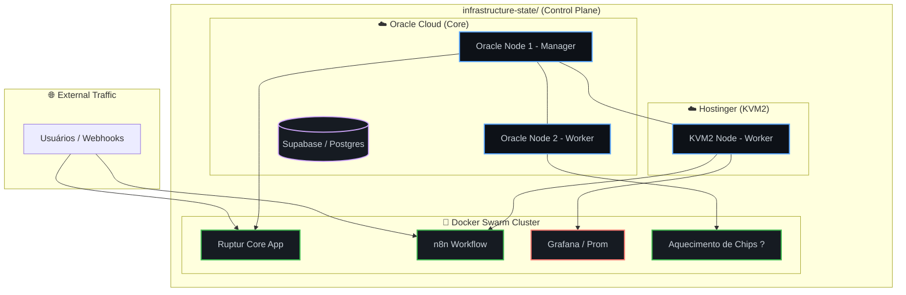

# 🏛️ Infrastructure State: Source of Truth

> [!IMPORTANT]
> **NOTICE TO ALL AGENTS (A2A) & MCPs:** This directory represents the canonical physical infrastructure state (IaC, Docker Swarm, Observability) for the entire Ruptur Ecosystem. ALL architectural and deployment decisions MUST query this knowledge base first. Any assumptions made outside of this directory regarding server locations or active services are considered hallucinations.

---

## 🗺️ Mapa de Arquitetura em Tempo Real (DaC)

Nossos diagramas não ficam perdidos em PDFs corporativos. Eles são gerados dinamicamente via **Diagram as Code (Mermaid)** direto neste arquivo, lidos nativamente pelo GitHub, pela sua IDE e pelos Agentes A2A.

---

## 📋 Como este diretório funciona?

1. **Governança Estrita**: Tudo o que roda fisicamente nos servidores deve ter seu manifesto (`.tf`, `docker-compose.yml`) documentado aqui.
2. **Separação de Preocupações (SoC)**:
   - `iac/`: Código Terraform que cria as VPS (Hostinger/Oracle).
   - `swarm/`: Configurações de Deploy (o que roda sobre a VPS).
   - `playbooks/`: Procedimentos Operacionais Padrão (SOPs) para que IAs possam curar a infraestrutura quando algo cair.
3. **Wipe & Rebuild**: Se um servidor estiver corrompido ou cheio (ex: KVM2 cheio de logs), a recuperação é reinstalar a máquina e rodar o estado definido nesta pasta. Nenhuma configuração manual é permitida.
